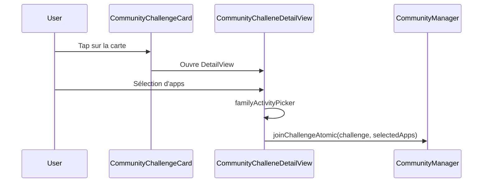
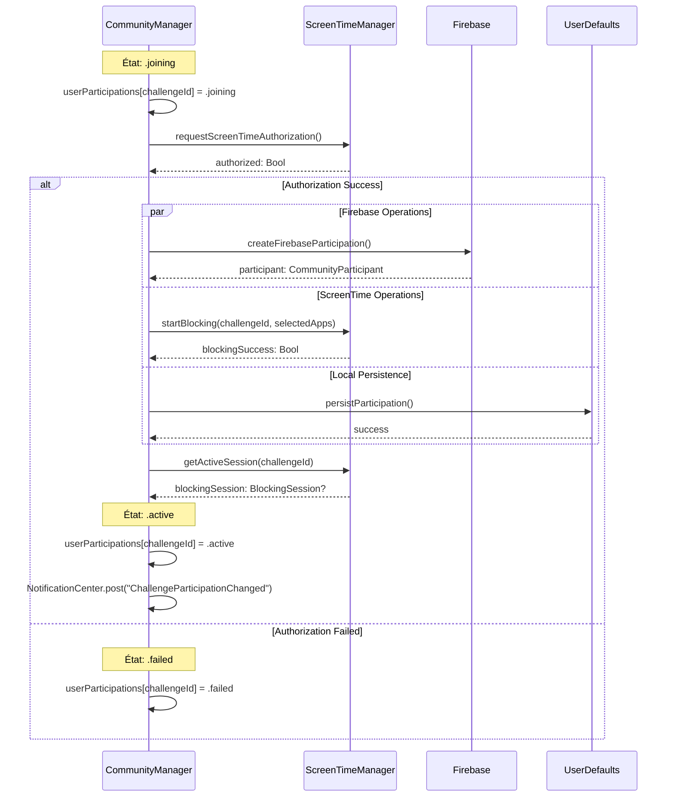
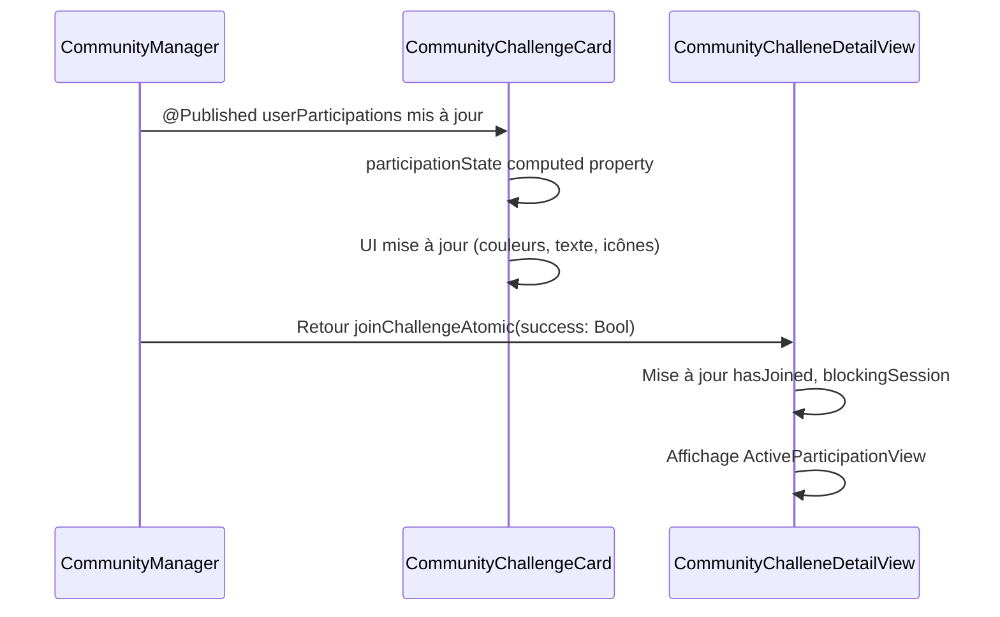
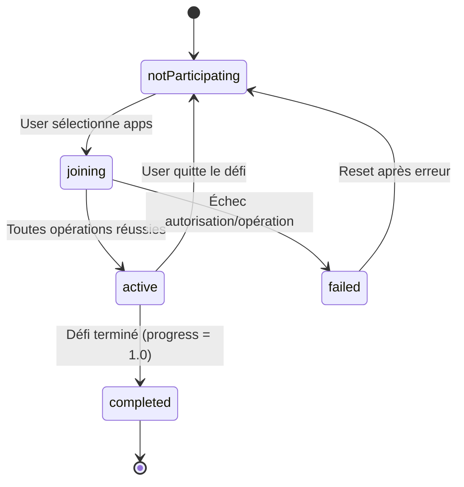
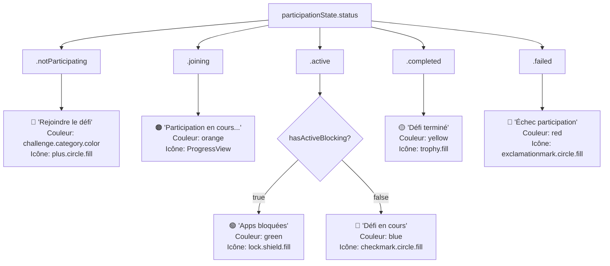
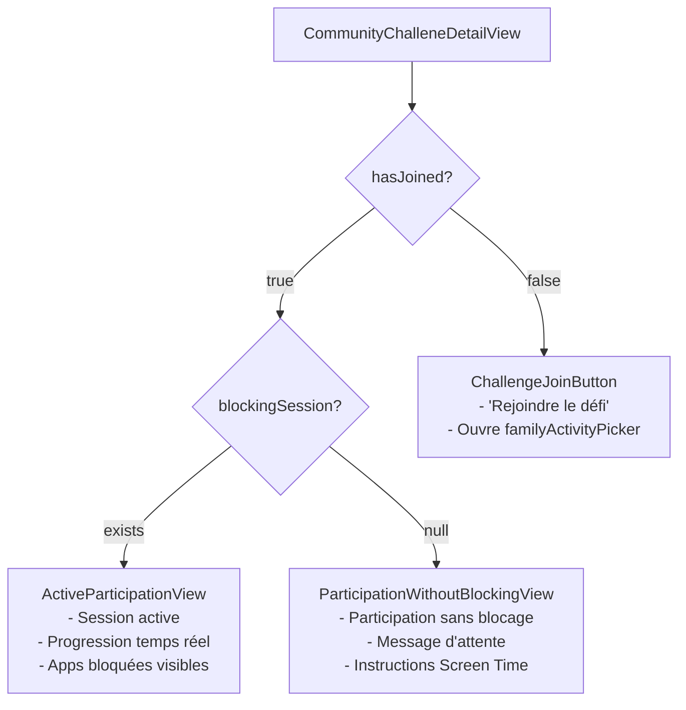
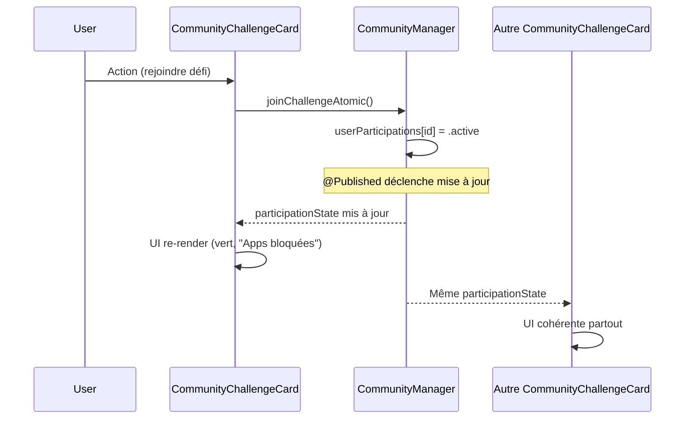
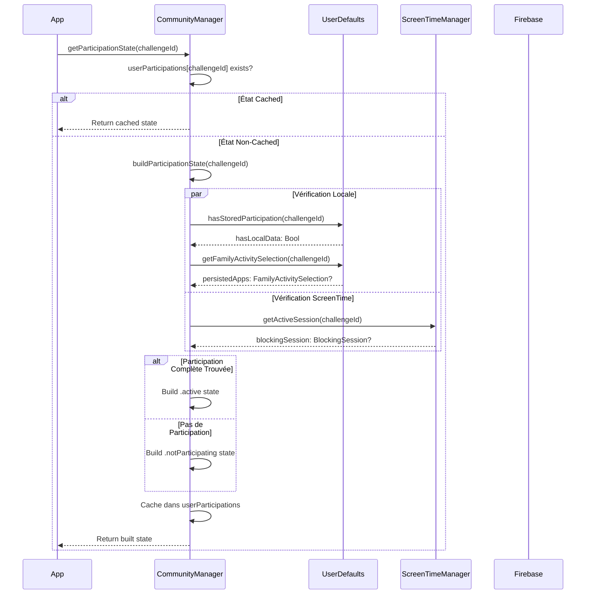

# 🎯 COMMUNITY VIEW - DIAGRAMME DE FLUX COMPLET

## 📋 TABLE DES MATIÈRES
1. [Architecture Générale](#architecture-générale)
2. [Flux de Participation Atomique](#flux-de-participation-atomique)
3. [États des Composants](#états-des-composants)
4. [Interactions entre Composants](#interactions-entre-composants)
5. [Gestion des Erreurs](#gestion-des-erreurs)
6. [Persistance et Synchronisation](#persistance-et-synchronisation)

---

## 🏗️ ARCHITECTURE GÉNÉRALE

```mermaid
graph TB
    subgraph "CommunityView"
        CV[CommunityView]
        CTS[CommunityTabBar]
        CCS[CommunityChallengesSection]
        CDS[CommunityDiscussionsSection]
    end

    subgraph "Challenge Components"
        CCC[CommunityChallengeCard]
        CCDV[CommunityChalleneDetailView]
        APS[ActiveParticipationView]
        PWB[ParticipationWithoutBlockingView]
    end

    subgraph "Single Source of Truth"
        CM[CommunityManager]
        UP[userParticipations: [String: ChallengeParticipationState]]
        PS[ParticipationStatus Enum]
        CPS[ChallengeParticipationState]
    end

    subgraph "External Systems"
        STM[ScreenTimeManager]
        FB[Firebase Firestore]
        UD[UserDefaults]
    end

    CV --> CTS
    CV --> CCS
    CV --> CDS
    CCS --> CCC
    CCC --> CCDV
    CCDV --> APS
    CCDV --> PWB

    CCC -.->|getParticipationState()| CM
    CCDV -.->|joinChallengeAtomic()| CM
    
    CM --> UP
    UP --> CPS
    CPS --> PS

    CM -.->|persistence| UD
    CM -.->|firebase ops| FB
    CM -.->|screen time| STM
```

---

## 🔄 FLUX DE PARTICIPATION ATOMIQUE

### Phase 1: Déclenchement


### Phase 2: Opération Atomique


### Phase 3: Mise à Jour Interface


---

## 🎭 ÉTATS DES COMPOSANTS

### ParticipationStatus Enum


### CommunityChallengeCard - États Visuels


### CommunityChalleneDetailView - Composants Conditionnels


---

## 🔗 INTERACTIONS ENTRE COMPOSANTS

### 1. CommunityView → CommunityChallengesSection
```mermaid
graph LR
    CV[CommunityView] --> CCS[CommunityChallengesSection]
    
    CV -.->|@ObservedObject| CM[CommunityManager.shared]
    CCS -.->|communityManager| CM
    
    CCS --> FOR[ForEach activeChallenges]
    FOR --> CCC[CommunityChallengeCard]
```

### 2. CommunityChallengeCard → Source de Vérité
```mermaid
graph TB
    CCC[CommunityChallengeCard]
    
    CCC --> PS[participationState: computed property]
    PS --> CM[CommunityManager.getParticipationState(challengeId)]
    
    CM --> UP[userParticipations[challengeId]]
    UP --> CPS[ChallengeParticipationState]
    
    CPS --> STATUS[status: ParticipationStatus]
    CPS --> APPS[selectedApps: FamilyActivitySelection?]
    CPS --> SESSION[blockingSession: BlockingSession?]
    CPS --> PARTICIPANT[participant: CommunityParticipant?]
```

### 3. Interface Réactive


---

## 🚨 GESTION DES ERREURS

### Scénarios d'Échec et Récupération
```mermaid
flowchart TD
    START[joinChallengeAtomic() démarré]
    
    START --> AUTH{Screen Time<br/>Authorization?}
    
    AUTH -->|❌ Refusée| FAIL_AUTH[État: .failed<br/>Message: Autorisation refusée]
    
    AUTH -->|✅ Accordée| OPERATIONS[Opérations Parallèles]
    
    OPERATIONS --> FB_OP[Firebase Operation]
    OPERATIONS --> ST_OP[ScreenTime Operation] 
    OPERATIONS --> UD_OP[UserDefaults Operation]
    
    FB_OP --> FB_CHECK{Success?}
    ST_OP --> ST_CHECK{Success?}
    UD_OP --> UD_CHECK{Success?}
    
    FB_CHECK -->|❌| FAIL_FB[Échec Firebase]
    ST_CHECK -->|❌| FAIL_ST[Échec ScreenTime]
    UD_CHECK -->|❌| FAIL_UD[Échec Persistence]
    
    FAIL_FB --> CLEANUP[Nettoyage États]
    FAIL_ST --> CLEANUP
    FAIL_UD --> CLEANUP
    
    CLEANUP --> FINAL_FAIL[État Final: .failed<br/>UI: Rouge, message d'erreur]
    
    FB_CHECK -->|✅| SUCCESS_CHECK{Toutes opérations<br/>réussies?}
    ST_CHECK -->|✅| SUCCESS_CHECK
    UD_CHECK -->|✅| SUCCESS_CHECK
    
    SUCCESS_CHECK -->|✅| SUCCESS[État Final: .active<br/>UI: Vert, blocage actif<br/>Notification envoyée]
```

### Types d'Erreurs et Affichage
```mermaid
graph TD
    ERRORS[Types d'Erreurs]
    
    ERRORS --> E1[Screen Time Refusé]
    ERRORS --> E2[Firebase Indisponible]
    ERRORS --> E3[Persistence Locale Échouée]
    ERRORS --> E4[Pas d'Apps Sélectionnées]
    
    E1 --> UI1[🔴 "Autorisation Screen Time requise"<br/>Bouton: "Aller aux Réglages"]
    E2 --> UI2[🟠 "Connexion Firebase échouée"<br/>Bouton: "Réessayer"]
    E3 --> UI3[🟡 "Erreur de sauvegarde locale"<br/>Bouton: "Réessayer"]
    E4 --> UI4[⚪ "Sélectionner des apps d'abord"<br/>Bouton: Désactivé]
```

---

## 💾 PERSISTANCE ET SYNCHRONISATION

### Stratégie de Persistance Multi-Niveaux
```mermaid
graph TB
    subgraph "Sources de Données"
        FB[Firebase Firestore<br/>- Participants<br/>- Challenges<br/>- Messages]
        UD[UserDefaults<br/>- Participations locales<br/>- FamilyActivitySelection<br/>- Sessions persistées]
        STM[ScreenTimeManager<br/>- BlockingSessions actives<br/>- DeviceActivity monitoring]
    end

    subgraph "CommunityManager - État Centralisé"
        UP[userParticipations<br/>[String: ChallengeParticipationState]]
    end

    subgraph "Synchronisation"
        SYNC[buildParticipationState()]
    end

    SYNC --> FB
    SYNC --> UD
    SYNC --> STM
    SYNC --> UP
    
    UP --> VIEWS[Views - Interface Cohérente]
```

### Flux de Synchronisation au Démarrage


### Cohérence des Données
```mermaid
flowchart TD
    DATA_SOURCES[Sources de Données]
    
    DATA_SOURCES --> LOCAL[Données Locales]
    DATA_SOURCES --> REMOTE[Données Distantes]
    
    LOCAL --> UD_DATA[UserDefaults<br/>- Participation metadata<br/>- FamilyActivitySelection<br/>- Timestamps]
    
    REMOTE --> FB_DATA[Firebase<br/>- CommunityParticipant<br/>- Challenge data<br/>- Messages]
    
    LOCAL --> SCREEN_DATA[ScreenTimeManager<br/>- BlockingSession<br/>- DeviceActivity state]
    
    subgraph "Validation de Cohérence"
        VALIDATE[buildParticipationState()]
        
        VALIDATE --> CHECK1{Local + Apps + Session<br/>tous présents?}
        CHECK1 -->|✅| VALID[État: .active<br/>Source: Local + ScreenTime]
        CHECK1 -->|❌| INVALID[État: .notParticipating<br/>Nettoyage si nécessaire]
    end

    UD_DATA --> VALIDATE
    FB_DATA --> VALIDATE  
    SCREEN_DATA --> VALIDATE
```

---

## 🎨 RÉCAPITULATIF VISUEL

### Avant Refactoring (Problématique)
```mermaid
graph TB
    subgraph "CHAOS - Multiples Sources"
        CCC1[CommunityChallengeCard<br/>hasJoined: Bool]
        CCDV1[CommunityChalleneDetailView<br/>hasJoined: Bool]
        CM1[CommunityManager<br/>Méthodes dispersées]
        FB1[Firebase - État]
        UD1[UserDefaults - État]
        STM1[ScreenTime - État]
    end
    
    CCC1 -.->|checkParticipation()| FB1
    CCC1 -.->|checkParticipation()| UD1
    CCDV1 -.->|checkExistingParticipation()| FB1  
    CCDV1 -.->|checkExistingParticipation()| UD1
    CM1 -.->|joinChallenge()| FB1
    CM1 -.->|startAppBlocking()| STM1
    
    style CCC1 fill:#ffcccc
    style CCDV1 fill:#ffcccc
    style CM1 fill:#ffcccc
```

### Après Refactoring (Solution)
```mermaid
graph TB
    subgraph "ORDRE - Source Unique"
        CM[CommunityManager<br/>Single Source of Truth]
        UP[userParticipations<br/>ChallengeParticipationState]
        
        CCC[CommunityChallengeCard<br/>participationState: computed]
        CCDV[CommunityChalleneDetailView<br/>joinChallengeAtomic()]
    end
    
    subgraph "Persistence Layer"
        FB[Firebase]
        UD[UserDefaults] 
        STM[ScreenTimeManager]
    end
    
    CCC --> UP
    CCDV --> CM
    CM --> UP
    
    CM -.->|Atomic Operations| FB
    CM -.->|Atomic Operations| UD
    CM -.->|Atomic Operations| STM
    
    style CM fill:#ccffcc
    style UP fill:#ccffcc
    style CCC fill:#ccffcc
    style CCDV fill:#ccffcc
```

---

## 🎯 POINTS CLÉS À RETENIR

### ✅ Avantages du Nouveau Système
1. **Source Unique de Vérité**: `CommunityManager.userParticipations`
2. **Opérations Atomiques**: Tout réussit ou tout échoue
3. **Interface Cohérente**: Computed properties basées sur l'état central
4. **Pas de Race Conditions**: Notifications après succès complet
5. **Code Maintenable**: Logique centralisée, pas de duplication

### 🔄 Flux Simplifié
```
User Action → joinChallengeAtomic() → Firebase + ScreenTime + Local → 
État Centralisé Mis à Jour → @Published → Interface Réactive → 
Cohérence Garantie Partout
```

### 🎨 États Visuels Clairs
- 🔵 **Non Participé**: "Rejoindre le défi" 
- 🟠 **En Cours**: "Participation en cours..." + ProgressView
- 🟢 **Actif + Bloqué**: "Apps bloquées" + Icônes apps
- 🔵 **Actif Sans Bloc**: "Défi en cours" + Message d'attente
- 🟡 **Terminé**: "Défi terminé" + Trophée
- 🔴 **Échec**: "Échec participation" + Bouton réessayer

Ce système garantit une **logique cohérente, sans bullshit, facile à maintenir et à comprendre** ! 🎉