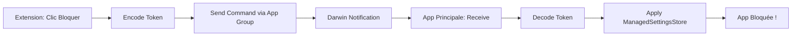

# Guide de Debug pour le Blocage d'Apps

## 🔍 Flux Attendu

### 1. Dans l'Extension (FullStatsPageView)
Quand vous cliquez sur "Bloquer X min" :

```
📤 [BLOCK_SHEET] Sending command to main app...
   → App: Instagram
   → Duration: 15 minutes
   → TokenData: 123 bytes
✅ [BLOCK_SHEET] Command sent successfully!
```

### 2. Dans l'App Principale
L'app devrait recevoir la commande immédiatement :

```
📬📬📬 [COORDINATOR] ============================================
📬 [COORDINATOR] DARWIN NOTIFICATION RECEIVED!
📬 [COORDINATOR] Processing commands NOW...
📬📬📬 [COORDINATOR] ============================================
📥 [COORDINATOR] Processing 1 pending commands
⚙️ [COORDINATOR] Processing command: addBlock
➕ [COORDINATOR] Adding block for Instagram - 15min
   → TokenData size: 123 bytes
💾 [COORDINATOR] Block saved with ID: xxx
✅ [COORDINATOR] Token decoded successfully
🔒 [COORDINATOR] ManagedSettingsStore applied for Instagram
   → Store name: block-xxx
   → Apps blocked: 1
✅ [COORDINATOR] Block Instagram processed and applied successfully
```

## 🚨 Points de Vérification

### 1. L'app principale est-elle en cours d'exécution ?
- L'app DOIT être au minimum en arrière-plan
- Si l'app est complètement fermée, elle ne peut pas recevoir les commandes
- **SOLUTION** : Ouvrez l'app principale avant de tester

### 2. BlockCommandCoordinator est-il démarré ?
Vérifiez dans les logs au démarrage de l'app :
```
🎧 [COORDINATOR] Starting command monitoring
📡 [COORDINATOR] Darwin observer configured - listening for commands...
✅ [COORDINATOR] Command monitoring started
```

### 3. Les permissions Screen Time sont-elles accordées ?
- Settings → Screen Time → Zenloop
- Family Controls doit être activé
- L'app doit avoir l'autorisation de bloquer des apps

### 4. Le token est-il correctement encodé ?
Dans l'extension, vérifiez :
```
✅ [BLOCK_SHEET] Token encoded successfully
```

Si vous voyez une erreur :
```
❌ [BLOCK_SHEET] Failed to encode token
```
→ Le token de l'app ne peut pas être sérialisé

## 🔧 Tests de Debug

### Test 1 : Communication Inter-Process
1. Ouvrez l'app principale
2. Gardez-la en arrière-plan
3. Ouvrez l'extension DeviceActivity (stats)
4. Essayez de bloquer une app
5. Revenez à l'app principale
6. Vérifiez les logs dans la console Xcode

### Test 2 : Vérification du Store
Dans l'app principale, après un blocage réussi :
1. Allez dans "Active Blocks" ou équivalent
2. L'app devrait apparaître comme bloquée
3. Essayez d'ouvrir l'app bloquée - elle devrait être restreinte

### Test 3 : Persistance
1. Bloquez une app depuis l'extension
2. Fermez complètement l'extension
3. Rouvrez l'extension
4. L'app devrait toujours apparaître comme bloquée

## 📊 Logs à Surveiller

### ✅ Succès
```
[COORDINATOR] ManagedSettingsStore applied
[SYNC] Block re-applied: Instagram
```

### ❌ Échecs Courants

#### L'app principale ne reçoit pas la commande :
```
(Silence - pas de log "DARWIN NOTIFICATION RECEIVED")
```
**Causes** :
- App principale fermée
- Darwin notification pas configurée
- App Group incorrect

#### Le token ne peut pas être décodé :
```
❌ [COORDINATOR] Failed to decode FamilyActivitySelection from tokenData
```
**Causes** :
- Token mal encodé
- Corruption des données
- Version incompatible

#### Le ManagedSettingsStore ne s'applique pas :
```
❌ ManagedSettings error: Not authorized
```
**Causes** :
- Permissions Screen Time manquantes
- Entitlements incorrects
- App pas autorisée par l'utilisateur

## 🎯 Solution Finale

Si le blocage ne fonctionne toujours pas :

1. **Vérifiez que l'app principale est ouverte** (au moins en arrière-plan)
2. **Vérifiez les permissions Screen Time**
3. **Regardez les logs dans Xcode Console** pendant le test
4. **Testez sur un vrai device** (le simulateur peut avoir des limitations)

## 🔄 Flux Complet Résumé



Si une étape échoue, le blocage ne fonctionnera pas.